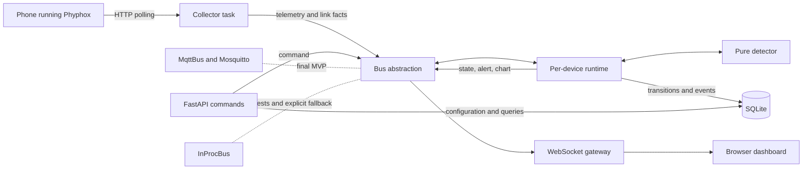
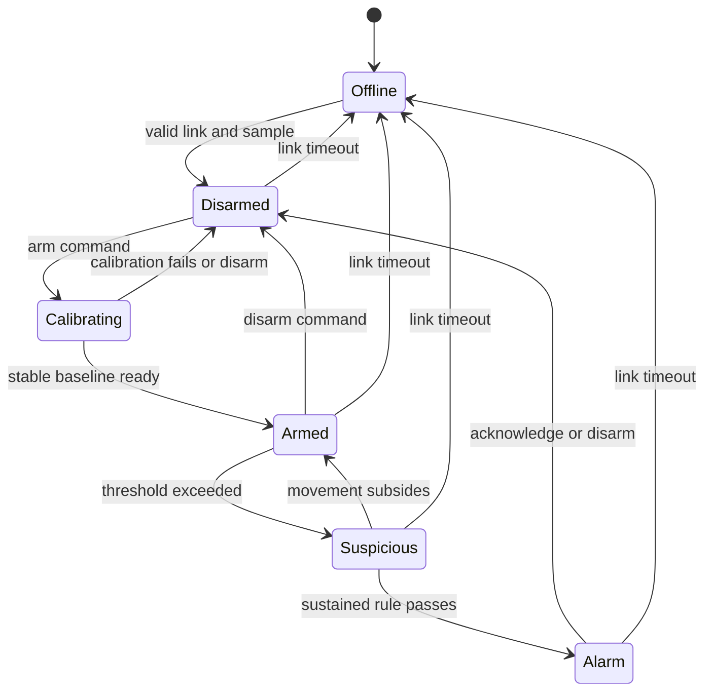

# FailureAntyTheft architecture and collaboration agreement

Status: ratified by Claude and Codex on 2026-07-21. This document refines the
high-level design in `PROJECT_PLAN.md`. It is a planning artifact; no
implementation has started.

## 1. Architecture decisions

1. The application runs as one FastAPI/asyncio process. Collector, detection,
   persistence, API, and WebSocket components remain separate logical modules,
   not separate operating-system services.
2. Components communicate through a typed `Bus` interface. `MqttBus` is the
   required default for the finished MVP and classroom demonstration.
   `InProcBus` is used for tests, replay, early milestones, and an explicitly
   configured degraded mode. The application must never silently switch away
   from MQTT when MQTT is configured.
3. SQLite is the runtime authority for device configuration and durable state.
   YAML may seed an empty database but is not a second runtime authority.
4. `DeviceDetector` is deterministic and has no I/O, sleeps, or database
   access. A per-device `DeviceRuntime` serializes telemetry, link changes,
   commands, and timer ticks, then performs persistence and bus publication.
5. The collector owns connectivity facts only. `DeviceRuntime` is the sole
   writer of operational state and all movement/connectivity events.
6. The API validates commands, publishes them, and returns HTTP 202. It does
   not write operational state before the runtime applies a command.
7. Acknowledging an active alarm records the acknowledgement, silences the
   client alarm, sets `desired_armed=false`, and transitions the device to
   `Disarmed`. Manual re-arming is required.
8. The browser receives state summaries and chart-ready magnitude data, not raw
   XYZ telemetry. Chart samples are limited to about 5 Hz and sent only for a
   device to which that client subscribed.

## 2. System sketch

The FastAPI lifespan owns the bus, database connection, collector tasks,
device-runtime tasks, and WebSocket gateway. One inbox per device provides
ordered handling without locks inside the detector.

## 3. Time model

Two time sources have different responsibilities:

- Phyphox/device sample time controls deduplication and the sustained movement
  rule, such as three threshold crossings inside 500 ms. Buffered samples must
  not be judged using their clustered HTTP receipt times.
- Server receipt/wall time orders cross-device events and drives online/offline
  reporting.
- Server monotonic time drives placement delay, calibration duration, cooldown,
  command timeouts, and periodic ticks. Each active or armed runtime receives a
  tick at 10 Hz.

Phone clocks are never assumed to be synchronized with each other.

## 4. Source of truth and persistence

Configuration and operational state are stored separately so each area has one
writer.

### `devices` — API-owned configuration

- `id`, `name`, `source_url`, `enabled`, `sensitivity`, `created_at`

### `device_state` — runtime-owned state

- `device_id`
- `desired_armed`: durable operator intent
- `last_state`: last observed snapshot for display and audit only
- `last_seen_at`, `last_motion_score`, `updated_at`

### `events` — runtime-owned history

- Movement alerts and connectivity warnings
- Acknowledgement metadata is written by the runtime after an acknowledge
  command is applied

`last_state` is never trusted to restore a device directly to `Armed`. On
startup, each runtime begins `Offline`. After the first valid link and sample it
becomes `Disarmed`. If `desired_armed` is true, it performs placement delay and
fresh calibration before entering `Armed`.

Every accepted transition is processed in this order:

1. apply the event to the pure detector;
2. persist resulting intent, state, and event changes;
3. publish the resulting state, alert, or chart messages.

## 5. State machine

Calibration fails rather than accepting a baseline when the placement window
has excessive variance.

## 6. Bus topics and ownership

| Topic | QoS / retain | Sole writer | Readers | Purpose |
|---|---|---|---|---|
| `failureantytheft/devices/{id}/telemetry` | 0 | Collector | Runtime | Normalized sample or sample batch |
| `failureantytheft/devices/{id}/link` | 1, retained | Collector | Runtime | Online, last-seen, and failure facts |
| `failureantytheft/devices/{id}/command` | 1 | API | Runtime | Arm, disarm, or acknowledge request |
| `failureantytheft/devices/{id}/state` | 1, retained | Runtime | WS gateway | Unified operational view |
| `failureantytheft/devices/{id}/alert` | 1 | Runtime | WS gateway | Movement/connectivity alert |
| `failureantytheft/devices/{id}/chart` | 0 | Runtime | WS gateway | Magnitude and motion score |
| `failureantytheft/system/status` | 1, retained | Application | WS gateway | Server and broker health |

All topic payloads are versioned Pydantic models. The initial contracts are:

- `Telemetry`: device ID, device/sample time, server receipt time, sequence,
  XYZ acceleration, and unit;
- `LinkState`: online flag, last seen time, and consecutive failure count;
- `Command`: action, request ID, optional event ID, and validated arguments;
- `DeviceState`: online flag, state enum, durable intent, motion score, last
  sample time, and update time;
- `Alert`: event ID, type, severity, score, threshold, start time, and state;
- `ChartSample`: device ID/time, magnitude, and motion score;
- `WsEnvelope`: version, type, payload, and server timestamp.

Command and event identifiers make QoS-1 duplicate delivery idempotent.

## 7. Main flows

### Startup

1. Load application configuration.
2. Open SQLite in WAL mode and initialize/upgrade the schema.
3. Optionally seed an empty database from YAML.
4. Start the configured bus; MQTT failure is visible and does not silently
   select the in-process bus.
5. Create runtimes from the database and start their inbox consumers.
6. Start one collector task for each enabled device.
7. Start API and WebSocket service and publish system readiness.

Shutdown cancels tasks in reverse order and closes HTTP, bus, and database
resources cleanly.

### Telemetry

The collector polls Phyphox, advances a cursor using its time channel, removes
duplicates, normalizes every sample, and publishes telemetry. The runtime feeds
samples to the detector, persists transitions/events, publishes state on change
plus an approximately 1 Hz heartbeat, and produces chart-ready data.

### Commands

The API validates a command and publishes it with a request ID, then returns
202. The runtime applies it in its ordered inbox and publishes the resulting
state. The UI shows the action as pending until the correlated WebSocket update
arrives.

For acknowledgement, the browser may stop audio immediately but must retain a
pending indicator. It restores/escalates the alarm UI if confirmation fails or
times out.

### Connectivity

After bounded failures the collector publishes `link.online=false`. The
runtime moves the device to `Offline` and creates a connectivity warning when
appropriate. Collection retries independently and recovery triggers a fresh
calibration whenever durable intent remains armed.

## 8. URL and network safety

Sensor URLs must:

- use plain HTTP for the trusted-LAN MVP;
- resolve to an RFC1918 or link-local address;
- not resolve to loopback, multicast, unspecified, or reserved addresses;
- use a configurable allowed port list, initially including Phyphox's expected
  port; and
- treat redirects as errors.

The collector resolves and validates again on every new connection attempt to
reduce DNS-rebinding risk. The prototype must remain on a trusted private LAN.

## 9. Ownership for later implementation

| Area | Owner | Deliverables / handoff |
|---|---|---|
| Contracts and architecture | Claude drafts; both review and freeze | Pydantic models, protocols, topic constants, state enum |
| Detection | Claude | Pure detector, calibration/filter/rule/state tests |
| Device runtime | Claude | Ordered inbox, ticks, persistence and publication |
| Persistence | Claude | Split schema, repository, WAL setup, retention/summary |
| Messaging | Claude | `InProcBus`, `MqttBus`, reconnect and duplicate tests |
| Phyphox integration | Codex | Client, polling cursor/deduplication, collector manager |
| URL validation | Codex | Registration and connect-time SSRF controls |
| HTTP and WebSocket | Codex | REST routes, async command path, subscriptions, CSV |
| Dashboard | Codex | Cards, chart, alarm, pending actions, event history |
| Application wiring | Joint design; Codex makes final edits | FastAPI lifespan and task supervision |
| Fixtures | Joint: Codex records; Claude reviews | Normalized JSONL plus raw-to-normalized notes |
| End-to-end integration | Codex leads; Claude supports | Automated integration tests and demo hardening |
| Report | Joint | Metrics, diagrams, limitations, presentation material |

To reduce merge collisions, only the frozen contracts and final application
wiring are joint integration points. Each implementation file otherwise has one
owner.

## 10. Staged delivery

1. **Freeze and feasibility:** ratify contracts; confirm actual Phyphox buffer
   names, units, `/get` behavior, and control behavior; record stationary and
   moving JSONL fixtures.
2. **Core on InProc:** detector, runtime, repository, collector, and replay pass
   tests; a terminal run detects one recorded or live movement.
3. **Control surface:** API, WebSocket, safety checks, and minimal dashboard
   complete arm, calibrate, alert, acknowledge, and disarm in a browser.
4. **MQTT default:** add Mosquitto-backed transport, retained state,
   reconnection, and broker restart tests; preserve identical contracts.
5. **Hardening:** multi-phone behavior, offline/recovery, threshold tuning,
   retention, CSV, restart persistence, and the complete cold-start demo.
6. **Report:** collect latency, detection rate, false-alert, reconnect, resource,
   throughput, and database-growth measurements.

## 11. Contract-freeze prerequisites

The software contracts may be drafted immediately, but Phyphox-specific fields
cannot be frozen until the feasibility spike confirms real output from the
available phones. In particular, the collector fixture must settle whether a
poll returns one sample or a buffered batch and which time channel is reliable.
