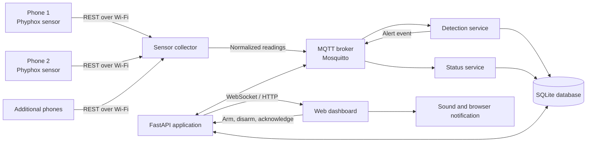
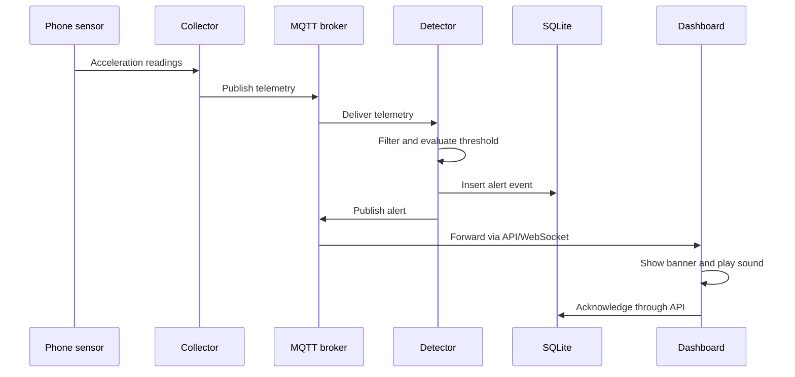
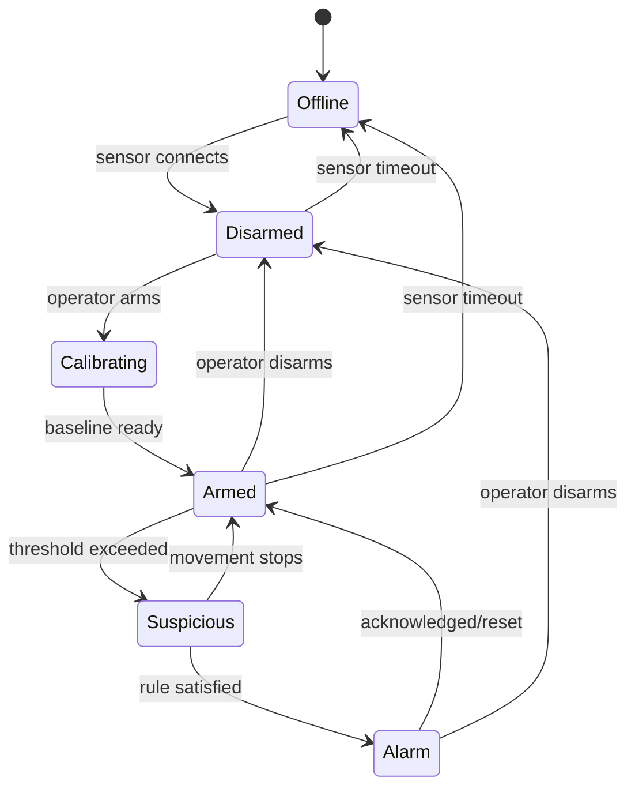

# FailureAlert: Phone-Based IoT Movement and Anti-Theft System

## 1. Project summary

FailureAlert is a local-network IoT system that uses ordinary smartphones as
wireless motion sensors. A phone is placed inside or attached to an object such
as a laptop bag, drawer, bicycle, laboratory item, or equipment case. When the
system is armed, unexpected movement creates an alert on a laptop dashboard and
is stored for later review.

The initial version requires no Arduino, Raspberry Pi, or dedicated sensor. It
uses:

- one or more phones as sensor nodes;
- one laptop as the server, MQTT broker, database, and dashboard host;
- a second laptop or phone as an optional monitoring screen; and
- a shared Wi-Fi network or a private phone/laptop hotspot.

The project demonstrates the complete IoT cycle:

1. **Sense:** phones measure acceleration and rotation.
2. **Communicate:** readings travel over Wi-Fi.
3. **Process:** the server detects suspicious movement.
4. **Store:** readings and alert events are saved.
5. **Visualize:** a live dashboard shows device and alarm states.
6. **Act:** the dashboard plays an alarm and displays a notification.

> This is a classroom prototype, not a certified security or emergency system.

## 2. Problem statement

Students and small organizations may want to monitor portable objects but lack
specialized IoT hardware. Meanwhile, most available smartphones already contain
accelerometers, gyroscopes, Wi-Fi, batteries, and processing capability.

The project investigates whether these existing devices can form an inexpensive
IoT monitoring network and reliably distinguish normal sensor noise from
meaningful object movement.

## 3. Objectives

### Primary objectives

- Collect live motion readings from at least two phones.
- Show each phone's online/offline and armed/disarmed state.
- Detect movement using configurable thresholds and time windows.
- Generate a real-time visual and audible alert.
- Save device status and alert history in a local database.
- Allow the operator to arm, disarm, acknowledge, and reset an alarm.
- Run entirely on a local network without paid cloud services.

### Optional objectives

- Send browser notifications to a monitoring phone.
- Add location information when a device supports it.
- Export alert history as CSV.
- Compare events from multiple phones to reduce false alarms.
- Provide an installable mobile web sensor as an alternative to Phyphox.
- Add authenticated remote access after the local version is stable.

## 4. Scope

### Minimum viable product (MVP)

The MVP will include:

- two phone sensor nodes;
- one laptop server;
- accelerometer readings at a modest sampling rate;
- a movement-detection algorithm;
- live charts and device-status cards;
- individual and global arm/disarm controls;
- an audible alarm;
- SQLite event history; and
- an end-to-end demonstration on a private Wi-Fi network.

### Out of scope for the MVP

- A native Android or iOS application
- Cellular/SMS integration
- Continuous public-internet access
- Facial recognition
- Guaranteed theft prevention
- Police or emergency-service contact
- Large-scale production deployment
- Machine learning before enough labelled data exists

Keeping these features out of the first version makes the project achievable by
one developer.

## 5. Users and use cases

### Operator

The operator opens the dashboard, checks whether sensors are online, arms a
device, receives an alert, acknowledges it, and reviews past events.

### Sensor owner

The owner opens Phyphox on a phone, enables its accelerometer experiment and
remote access, then places the phone with the protected object.

### Main use cases

1. Monitor a laptop bag while it is left in a room.
2. Detect a drawer or equipment case being opened or moved.
3. Demonstrate several independent IoT sensor nodes on one dashboard.
4. Record vibration or handling events for later analysis.

## 6. Functional requirements

| ID | Requirement | Priority |
|---|---|---|
| FR-01 | Register a phone sensor with a name and local network address | Must |
| FR-02 | Collect timestamped X, Y, and Z acceleration readings | Must |
| FR-03 | Show whether every registered phone is online or offline | Must |
| FR-04 | Arm and disarm each phone independently | Must |
| FR-05 | Detect sustained movement rather than a single noisy sample | Must |
| FR-06 | Create a persistent alert event when armed movement is detected | Must |
| FR-07 | Display and sound a live alarm on connected dashboards | Must |
| FR-08 | Allow an operator to acknowledge an active alert | Must |
| FR-09 | Store and display alert history | Must |
| FR-10 | Change sensitivity from the dashboard or configuration | Should |
| FR-11 | Export event history as CSV | Should |
| FR-12 | Send browser notifications when permission is granted | Could |
| FR-13 | Group multiple simultaneous sensor events into one incident | Could |

## 7. Non-functional requirements

- **Latency:** show an alert within two seconds of sustained movement on a
  healthy local network.
- **Reliability:** reconnect automatically after a temporary phone or Wi-Fi
  interruption.
- **Performance:** support at least five phones at 10 readings per second on an
  ordinary laptop.
- **Privacy:** keep raw readings and events on the local laptop by default.
- **Security:** do not expose the unauthenticated prototype to the public
  internet.
- **Usability:** the main system status must be understandable at a glance.
- **Maintainability:** separate sensor collection, detection, persistence, and
  user-interface code.
- **Portability:** support a current Linux, Windows, or macOS laptop where
  practical.

## 8. Proposed architecture



### Why this architecture

- **Phyphox** exposes phone sensors without requiring a custom mobile app.
- **The collector** hides phone-specific formats and produces one consistent
  message format.
- **MQTT** demonstrates publish/subscribe communication commonly used in IoT.
- **The detection service** can be tested separately from data collection.
- **FastAPI and WebSocket** provide live browser updates and control endpoints.
- **SQLite** requires no separate database server and is sufficient for the
  prototype.

### Simplification fallback

If MQTT setup becomes a schedule risk, the collector may initially call the
detection service directly. MQTT should then be added after the complete path
works. The user-facing behavior and data model do not need to change.

## 9. Physical and network layout

```text
Protected object A                 Protected object B
+------------------+              +------------------+
| Phone A          |              | Phone B          |
| accelerometer    |              | accelerometer    |
+--------+---------+              +--------+---------+
         | Wi-Fi                           | Wi-Fi
         +---------------+-----------------+
                         |
                 +-------v--------+
                 | Private router |
                 | or hotspot     |
                 +-------+--------+
                         |
               +---------v----------+
               | Server laptop      |
               | collector + MQTT   |
               | API + SQLite       |
               +---------+----------+
                         |
                +--------v---------+
                | Any web browser  |
                | live dashboard   |
                +------------------+
```

All devices must be on the same LAN and able to communicate directly. Some
institutional or guest Wi-Fi networks isolate clients; a private hotspot is a
safer choice for the final demonstration.

## 10. Component design

### 10.1 Phone sensor nodes

For the MVP, each phone runs the free Phyphox application:

1. Select an accelerometer experiment.
2. Enable remote access.
3. Copy the local address shown by the application.
4. Register that address on the server.
5. Start measurement and place the phone securely.

The system must not assume every phone has identical sensor names, sampling
rates, or accuracy. Device-specific mapping belongs in configuration.

### 10.2 Sensor collector

The collector is a Python background task for each registered phone. It will:

- check phone availability;
- request new readings from the Phyphox remote interface;
- attach a device ID and server receipt time;
- reject malformed or duplicate readings;
- convert values to a consistent unit and JSON format;
- publish normalized readings to MQTT; and
- publish an offline status after repeated failures.

A failed request should use short bounded retries. It must not freeze collection
from the other phones.

### 10.3 MQTT broker

Mosquitto runs locally on the server laptop. During development it should listen
only on trusted interfaces. Public deployment would require authentication,
authorization, and TLS.

Suggested topics:

```text
failurealert/devices/{device_id}/telemetry
failurealert/devices/{device_id}/status
failurealert/devices/{device_id}/command
failurealert/devices/{device_id}/alert
failurealert/system/status
```

Suggested quality-of-service levels:

- telemetry: QoS 0, because a later sample replaces a missed live sample;
- commands and alerts: QoS 1, because delivery matters;
- status: QoS 1 with a retained last-known state where appropriate.

### 10.4 Detection service

The service subscribes to normalized telemetry. For every device it maintains:

- armed/disarmed state;
- calibration baseline;
- recent filtered readings;
- movement counter;
- current incident state; and
- alert cooldown timestamp.

It emits an alert only if the configured rule is satisfied while the device is
armed.

### 10.5 API and real-time gateway

FastAPI will provide:

- REST endpoints for devices, settings, and event history;
- WebSocket updates for live status and alerts;
- validation for all operator commands;
- static dashboard hosting during development; and
- CSV export as a later feature.

### 10.6 Database

SQLite stores configuration and important events. Raw high-frequency sensor
samples should not all be retained indefinitely. The MVP may keep a short sample
window around each alert or downsample readings before storage.

### 10.7 Dashboard

The dashboard should have four areas:

1. **System header:** broker/server state, connected devices, and global arm
   control.
2. **Device cards:** name, online state, armed state, last reading, motion level,
   and sensitivity.
3. **Live chart:** recent acceleration magnitude for a selected device.
4. **Event table:** time, device, severity, state, and acknowledgement.

Use color and text together; do not make red/green color the only indication of
state.

## 11. Data flow

### Normal telemetry flow

1. A phone measures acceleration.
2. The collector reads the latest measurements.
3. The collector normalizes and publishes them.
4. The detector filters the readings and calculates a motion score.
5. The dashboard receives a compact live update.
6. The server periodically records device health.

### Alert flow



### Offline flow

1. The collector fails to reach a phone several times.
2. It marks the device offline and publishes status.
3. The dashboard changes the device card to offline.
4. If the device was armed, the system creates a connectivity warning.
5. Collection resumes automatically when the phone returns.

## 12. Message formats

### Telemetry message

```json
{
  "device_id": "phone-01",
  "device_time": "2026-07-21T10:30:14.420+06:00",
  "received_time": "2026-07-21T10:30:14.510+06:00",
  "sequence": 1521,
  "acceleration": {
    "x": 0.12,
    "y": -0.08,
    "z": 9.79,
    "unit": "m/s2"
  }
}
```

### Device-status message

```json
{
  "device_id": "phone-01",
  "online": true,
  "armed": true,
  "last_seen": "2026-07-21T10:30:14.510+06:00",
  "motion_score": 0.18
}
```

### Alert message

```json
{
  "event_id": "evt-20260721-0007",
  "device_id": "phone-01",
  "type": "movement_detected",
  "severity": "high",
  "motion_score": 3.64,
  "threshold": 1.50,
  "started_at": "2026-07-21T10:31:02.130+06:00",
  "state": "active"
}
```

Never treat timestamps sent by different phones as perfectly synchronized. The
server receipt time is the reference for ordering cross-device events.

## 13. Movement-detection algorithm

### Basic calculation

For each accelerometer sample, calculate its magnitude:

```text
magnitude = sqrt(x^2 + y^2 + z^2)
```

When a stationary phone includes gravity in its measurements, its magnitude is
approximately 9.81 m/s². A simple motion score is:

```text
motion_score = abs(filtered_magnitude - baseline_magnitude)
```

### Calibration and filtering

1. After arming, provide a five-second placement delay.
2. Collect stationary readings during a short calibration window.
3. Use their median as the baseline.
4. Apply an exponential moving average or short rolling median to reduce noise.
5. Ignore isolated threshold crossings.

### Initial detection rule

Create an alert when all of these are true:

- the device is armed;
- the motion score exceeds its threshold;
- it exceeds the threshold for at least three samples inside 500 ms; and
- the device is not already inside the alert cooldown period.

All values must be configurable because phones have different noise levels.

### State machine



## 14. Database design

### `devices`

| Column | Type | Notes |
|---|---|---|
| `id` | TEXT primary key | Stable internal device ID |
| `name` | TEXT | Human-readable name |
| `source_url` | TEXT | Local Phyphox address; protect in public deployments |
| `enabled` | BOOLEAN | Whether collection should run |
| `armed` | BOOLEAN | Current armed state |
| `sensitivity` | REAL | Device-specific threshold |
| `created_at` | DATETIME | Registration time |
| `last_seen_at` | DATETIME nullable | Latest successful reading |

### `events`

| Column | Type | Notes |
|---|---|---|
| `id` | TEXT primary key | Event identifier |
| `device_id` | TEXT foreign key | Source device |
| `event_type` | TEXT | Movement, offline, reconnected, etc. |
| `severity` | TEXT | Info, warning, or high |
| `motion_score` | REAL nullable | Score that caused a movement alert |
| `threshold` | REAL nullable | Threshold at alert time |
| `started_at` | DATETIME | Detection time |
| `acknowledged_at` | DATETIME nullable | Operator acknowledgement time |
| `acknowledged_by` | TEXT nullable | Operator label for the prototype |
| `details_json` | TEXT nullable | Additional structured information |

### `telemetry_summary`

This optional table stores one summary per time interval rather than every raw
sample.

| Column | Type | Notes |
|---|---|---|
| `id` | INTEGER primary key | Auto-incrementing key |
| `device_id` | TEXT foreign key | Source device |
| `window_start` | DATETIME | Start of aggregation window |
| `minimum` | REAL | Minimum magnitude |
| `maximum` | REAL | Maximum magnitude |
| `average` | REAL | Average magnitude |
| `sample_count` | INTEGER | Valid readings in window |

## 15. Proposed API

| Method | Route | Purpose |
|---|---|---|
| `GET` | `/api/health` | Server and broker health |
| `GET` | `/api/devices` | List devices and current states |
| `POST` | `/api/devices` | Register a sensor node |
| `PATCH` | `/api/devices/{id}` | Change name, address, or sensitivity |
| `POST` | `/api/devices/{id}/arm` | Start delay and calibration, then arm |
| `POST` | `/api/devices/{id}/disarm` | Disarm a device |
| `GET` | `/api/events` | Filtered alert/event history |
| `POST` | `/api/events/{id}/acknowledge` | Acknowledge an event |
| `GET` | `/api/events/export.csv` | Export event history |
| `WS` | `/ws` | Live readings, state changes, and alerts |

Request bodies and query parameters must be validated. Unknown device IDs and
invalid state transitions should return clear errors.

## 16. Suggested repository structure

```text
FailureAllert/
├── PROJECT_PLAN.md
├── README.md
├── pyproject.toml
├── .env.example
├── config/
│   └── devices.example.yaml
├── src/
│   └── failurealert/
│       ├── main.py
│       ├── config.py
│       ├── collector/
│       │   ├── manager.py
│       │   └── phyphox.py
│       ├── messaging/
│       │   └── mqtt.py
│       ├── detection/
│       │   ├── detector.py
│       │   └── state.py
│       ├── api/
│       │   ├── routes.py
│       │   └── websocket.py
│       ├── database/
│       │   ├── models.py
│       │   └── repository.py
│       └── static/
│           ├── index.html
│           ├── app.js
│           └── styles.css
├── tests/
│   ├── fixtures/
│   ├── test_detector.py
│   ├── test_api.py
│   └── test_collector.py
└── data/
    └── .gitkeep
```

Generated database files, recorded sensor data, secrets, and local environment
files should be ignored by Git.

## 17. Implementation plan

### Phase 0: feasibility check — half a day

- Install Phyphox on available phones.
- Put phones and a laptop on the intended Wi-Fi/hotspot.
- Verify that each phone's remote page is reachable from the laptop.
- Record sample stationary and moving data.
- Confirm units and available buffer names for every phone.

**Exit criterion:** the laptop can retrieve valid accelerometer readings from at
least two phones.

### Phase 1: data collection — 1 to 2 days

- Create project configuration and device registration.
- Implement one asynchronous collection task per phone.
- Normalize readings into the documented JSON structure.
- Log connection failures and automatic recovery.
- Create a replayable sample-data fixture for offline development.

**Exit criterion:** a terminal view continuously shows normalized readings and
online/offline transitions from two phones.

### Phase 2: movement detection — 1 to 2 days

- Implement magnitude calculation, calibration, and filtering.
- Add the device state machine.
- Add sustained-threshold detection and cooldown.
- Write unit tests using stationary, normal movement, and strong movement data.

**Exit criterion:** recorded data produces repeatable results with acceptably few
false alarms.

### Phase 3: MQTT integration — 1 day

- Configure a local Mosquitto broker.
- Publish telemetry and status topics.
- Subscribe the detector to telemetry.
- Publish alerts and commands with suitable QoS.
- Test broker restart and subscriber reconnection.

**Exit criterion:** collection, detection, and alert delivery communicate through
MQTT and recover after a broker restart.

### Phase 4: API and persistence — 1 to 2 days

- Create SQLite tables and migrations or startup initialization.
- Implement device and event repositories.
- Implement the core REST endpoints.
- Add WebSocket broadcasting.
- Validate commands and error responses.

**Exit criterion:** devices can be controlled through the API and alert history
survives a server restart.

### Phase 5: dashboard — 2 days

- Build responsive device cards and system status.
- Add arm/disarm and acknowledge actions.
- Plot a limited rolling window of sensor data.
- Add alarm banner and sound.
- Add event-history filtering.
- Test the interface on laptop and phone browsers.

**Exit criterion:** an operator can complete the full workflow without using a
terminal.

### Phase 6: integration and hardening — 1 to 2 days

- Test two or more phones concurrently.
- Tune per-device thresholds.
- Handle sensor, network, broker, and server interruptions.
- Add data retention and log rotation limits.
- Improve setup instructions and error messages.

**Exit criterion:** the planned demonstration succeeds repeatedly from a fresh
start.

### Phase 7: report and presentation — 1 day

- Capture architecture and dashboard screenshots.
- Record test results and limitations.
- Prepare a three-to-five-minute backup demo video.
- Prepare presentation slides and speaking notes.

## 18. Solo-work strategy

Although this may be presented as a group project, implementation should be
organized by modules rather than pretending several people developed it.

Recommended order:

1. Make one phone produce readings.
2. Detect one obvious movement in a terminal.
3. Store one alert.
4. Show one alert in a browser.
5. Add the second phone.
6. Add MQTT and optional features.

At the end of every phase, keep a runnable version. Do not build every component
at once and integrate only near the deadline.

## 19. Testing plan

### Unit tests

- Acceleration magnitude calculation
- Filtering and baseline calculation
- Threshold and consecutive-sample logic
- Cooldown behavior
- Valid and invalid state transitions
- Message and API validation
- Database event creation and acknowledgement

### Integration tests

- Recorded sensor data through collector to detector
- MQTT publish/subscribe and reconnect
- API command changes detector state
- Alert insertion followed by WebSocket broadcast
- Server restart preserves devices and event history

### Physical tests

| Test | Setup | Expected result |
|---|---|---|
| Stationary noise | Phone remains untouched for 10 minutes | No movement alert |
| Small vibration | Tap nearby surface lightly | Score changes; behavior matches sensitivity |
| Protected-object movement | Lift or move the bag/drawer | Alert within two seconds |
| Reorientation | Rotate phone slowly | Movement alert while armed |
| Wi-Fi loss | Disable Wi-Fi on an armed phone | Offline warning appears |
| Reconnection | Restore Wi-Fi | Phone returns online automatically |
| Multiple phones | Move only one protected object | Correct device is identified |
| Simultaneous event | Move two phones together | Both sources appear without data corruption |
| Acknowledge | Click acknowledge during alarm | Sound stops and event is updated |

### Acceptance criteria

- Two phones remain visible and update for a 15-minute demonstration.
- Normal stationary noise causes no alert during that period.
- Five out of five intentional object movements create alerts within two seconds.
- Acknowledged alerts remain visible in history after restarting the server.
- Disconnecting a phone produces an offline indication and reconnects without
  restarting the whole application.

## 20. Risks and mitigations

| Risk | Impact | Mitigation |
|---|---|---|
| Campus Wi-Fi blocks device-to-device traffic | Phones cannot reach laptop | Use a private hotspot and test it early |
| Different phones report different sensor behavior | One threshold performs poorly | Calibrate and store sensitivity per device |
| Phyphox address changes after reconnecting | Collector loses the phone | Make source addresses editable and document setup |
| Phone sleeps or pauses the sensor app | Missing data | Keep the app foregrounded and disable battery optimization for the demo |
| Sensor noise creates false alerts | Unconvincing result | Filter data and require sustained movement |
| Too much raw data fills storage | Slow or large database | Store events and downsampled summaries only |
| Browser blocks autoplay sound/notifications | Alert is silent | Require an initial “Enable alerts” interaction and keep a visible alarm |
| Publicly exposed broker or phone REST interface | Unauthorized access | Keep MVP on an isolated LAN; add credentials/TLS before remote access |
| Attempting optional features too early | Core system remains unfinished | Enforce MVP exit criteria before extensions |

## 21. Security and privacy

- Use a trusted private network for demonstrations.
- Do not forward Mosquitto, FastAPI, or Phyphox ports from the router.
- Validate device IDs, URLs, JSON bodies, and numeric ranges.
- If source URLs can be entered through the dashboard, restrict them to expected
  private-network destinations to reduce server-side request forgery risk.
- Do not collect microphone, camera, contact, or personal-location data for the
  movement-monitoring MVP.
- Store only what is necessary and define a simple deletion/retention policy.
- Add login, MQTT authentication, TLS, and proper secret management before using
  the design outside a trusted classroom LAN.

## 22. Demonstration plan

### Preparation

- Charge all devices.
- Use a known hotspot and assign recognizable phone names.
- Start Mosquitto, the backend, and the dashboard.
- Verify live data before the presentation begins.
- Keep recorded sensor data and a short demo video as fallbacks.

### Live demonstration script

1. Show two online but disarmed phone nodes.
2. Explain the architecture diagram in about 30 seconds.
3. Arm Phone A and show the placement/calibration countdown.
4. Leave it stationary to demonstrate noise filtering.
5. Move the protected object and show the alert, chart spike, and event entry.
6. Acknowledge the alert from a second laptop or phone.
7. Disconnect Phone B from Wi-Fi and show offline detection.
8. Reconnect it and show automatic recovery.
9. Open history to show persisted events.

### Points to explain to evaluators

- Smartphones are real sensor nodes, not simulated input.
- MQTT decouples producers from consumers.
- Detection uses filtering, calibration, and time-based rules.
- SQLite provides a persistent audit trail.
- The project is low-cost, locally deployable, and extendable to dedicated
  hardware later.

## 23. Evaluation metrics

Record results rather than saying only that the system “worked.”

- average and 95th-percentile alert latency;
- detection rate over a fixed number of intentional movements;
- false alerts during a fixed stationary period;
- reconnect time after network interruption;
- CPU and memory usage on the server laptop;
- messages or samples processed per second; and
- database growth over a 30-minute run.

## 24. Future extensions

After the MVP is complete:

- Replace Phyphox with an installable PWA or native application.
- Add gyroscope-based classification of lift, tilt, shake, and impact.
- Associate a last-known GPS position with an alert, with explicit consent.
- Add encrypted authenticated communication.
- Send notifications through a self-hosted or approved notification service.
- Deploy the server on a Raspberry Pi when hardware becomes available.
- Add an ESP32 accelerometer node while retaining the same MQTT topics.
- Train a classifier only after collecting and labelling sufficient real data.

## 25. Definition of done

The project is complete when:

- a new user can follow the README and start the system;
- at least two real phones provide live measurements;
- devices can be armed and disarmed from the dashboard;
- intentional movement reliably produces a timely alert;
- stationary phones do not repeatedly produce false alarms;
- events persist and can be acknowledged;
- network interruption is clearly shown and recovery is automatic;
- core automated tests pass; and
- the report states limitations honestly.

## 26. Immediate next actions

1. Install Phyphox on two phones.
2. Confirm remote access from the development laptop over the intended network.
3. Save a short stationary dataset and a short movement dataset.
4. Scaffold the Python project and implement the Phyphox collector.
5. Build and test the movement detector using the saved data before creating the
   dashboard.
